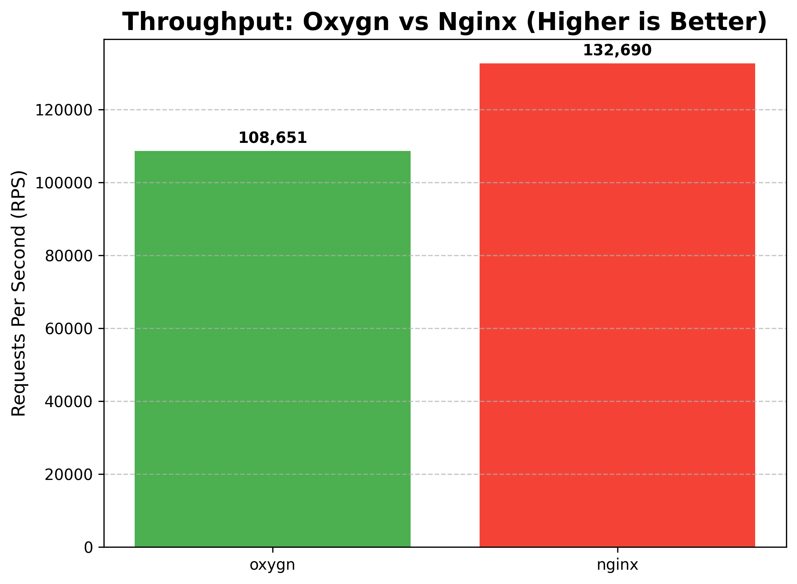
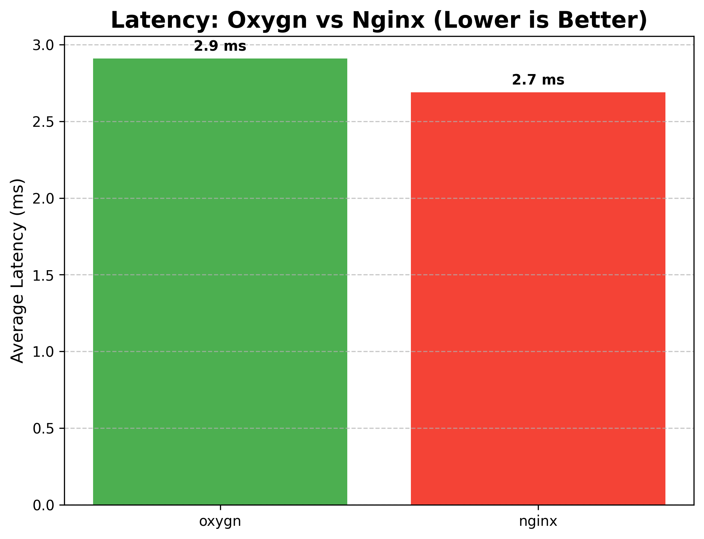
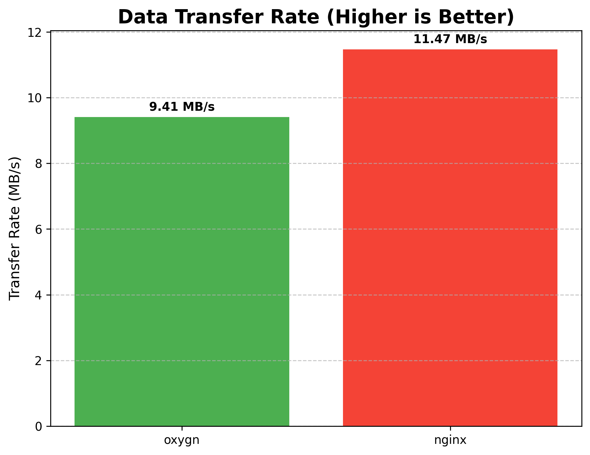
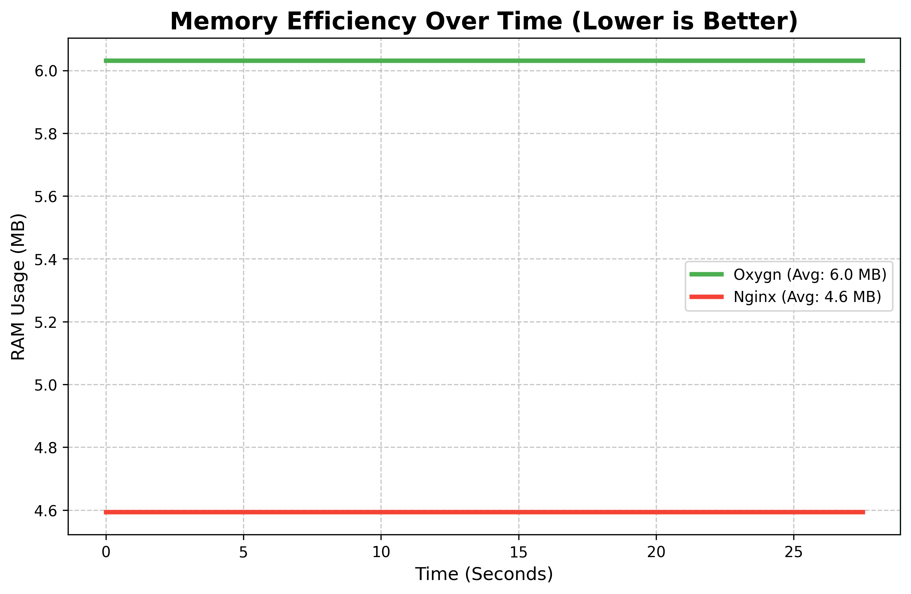

# Some graphs that the benchmarking tool generates

### Throughput (Higher is Better)

### Latency (Lower is Better)

### Transfer Rate (Higher is Better)

### Memory Usage Over Time (Lower is Better)

